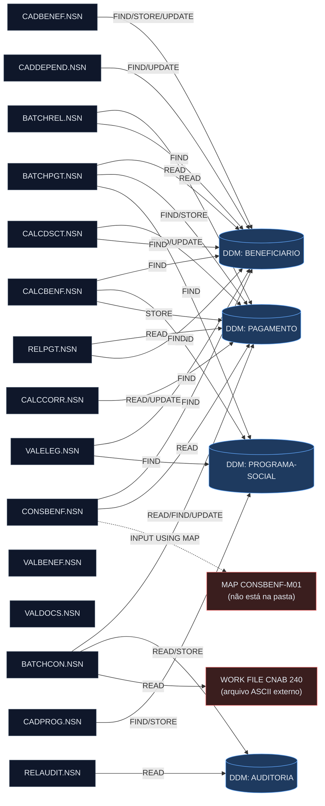
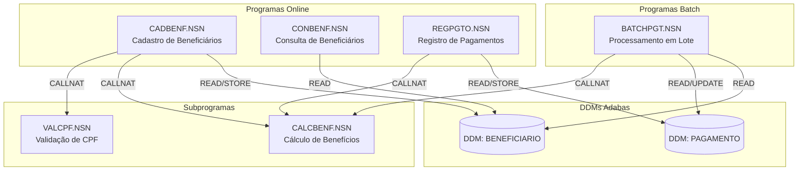
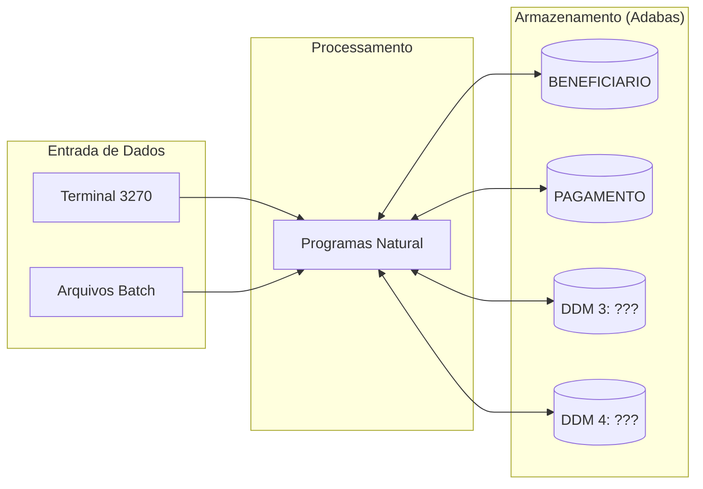

<!-- markdownlint-disable MD013 MD025 MD026 MD028 MD029 MD034 MD040 MD051 MD060 -->

# Mapa de Dependências — SIFAP Legado

  

> 🗺 **Você está aqui:** [Kit PT-BR](../README.md) → [Estágio 1](README.md) → **dependency-map**

> **Para quem é isto?** Este é um **artefato preenchido pelo time** durante o Estágio 1 (Arqueologia).
>
> **O que você terá ao final do estágio:**
>
> 1. Este documento totalmente preenchido com os dados reais do legado SIFAP
> 2. Rastreabilidade para `01-arqueologia/legado-sifap/` (programas `.NSN` e DDMs)
> 3. Base de evidência usada nas EARS do Estágio 2 (`source_legacy:`)
>
> 📘 **Guia passo a passo:** [`GUIDE.md`](GUIDE.md).


> Use diagramas Mermaid para mapear as dependências entre programas Natural e DDMs Adabas.
> O objetivo é visualizar "quem chama quem" e "quem lê/escreve o quê".

## Como descobrir dependências

- Use `grep` ou Copilot Chat para listar todas as ocorrências de `CALLNAT` nos 15 arquivos `.NSN`.
- Prompt útil: _"Liste todas as ocorrências de CALLNAT nestes arquivos e desenhe um diagrama Mermaid."_
- Para leitura/escrita em DDMs: procure por `READ`, `READ LOGICAL`, `STORE`, `UPDATE`, `DELETE`.

---

> ⬇️ **Mapa real gerado por `/map-dependencies`** (escopo: `01-arqueologia/legado-sifap/natural-programs/`, 15 programas).
> As seções de **exemplo/template** abaixo deste bloco podem ser descartadas — foram substituídas pelo conteúdo real.

## Achado Principal — Nenhum CALLNAT, Nenhum INCLUDE

A varredura dos 15 programas **não encontrou nenhuma instrução `CALLNAT` nem `INCLUDE`**. Toda composição é feita por `PERFORM` de subrotinas **internas** ao próprio programa. Consequências:

- **Zero arestas programa-a-programa.** Os 15 programas são ilhas que se comunicam **somente pelos DDMs** (acoplamento por dados, não por chamada).
- Vários headers/comentários **afirmam** chamadas que não existem no código (ver Referências Fantasma). Ex.: o header de `BATCHPGT` diz "CHAMA CALCBENF E CALCDSCT", mas a lógica está **duplicada inline** — não há CALLNAT.
- Logo, o grafo é essencialmente **programa → DDM** (e alguns recursos externos).

## Diagrama Mermaid (real)



> `VALBENEF.NSN` e `VALDOCS.NSN` **não acessam nenhum DDM** — recebem dados por `INPUT` e só validam. Aparecem fora do grafo de dados (ver Programas Isolados).

## Arestas Programa-para-Programa

**Nenhuma.** Não há `CALLNAT` nem `INCLUDE` em nenhum dos 15 programas. O acoplamento entre programas é **exclusivamente por dados** (DDMs compartilhados).

## Arestas Programa-para-Dados

> Linhas marcadas com `~` são aproximadas: `BATCHPGT.NSN` e `BATCHCON.NSN` foram lidos a partir de colagem **sem numeração nativa**; confirmar com `grep -n`. As demais têm linha exata (`cat -n`).

| Programa | DDM/Recurso | Operação | Arquivo | Linha |
|----------|-------------|----------|---------|-------|
| BATCHPGT | PAGAMENTO | READ (último num) | BATCHPGT.NSN | ~176 |
| BATCHPGT | BENEFICIARIO | READ (loop, BY CPF) | BATCHPGT.NSN | ~182 |
| BATCHPGT | PAGAMENTO | FIND (já gerou?) | BATCHPGT.NSN | ~204 |
| BATCHPGT | PROGRAMA-SOCIAL | FIND | BATCHPGT.NSN | ~214 |
| BATCHPGT | PAGAMENTO | STORE | BATCHPGT.NSN | ~332 |
| BATCHCON | AUDITORIA | READ (último seq) | BATCHCON.NSN | ~89 |
| BATCHCON | CNAB (work file) | READ WORK FILE | BATCHCON.NSN | ~108 |
| BATCHCON | PAGAMENTO | FIND (casar retorno) | BATCHCON.NSN | ~139 |
| BATCHCON | PAGAMENTO | FIND+UPDATE (ret 00→P) | BATCHCON.NSN | ~172 |
| BATCHCON | PAGAMENTO | FIND+UPDATE (ret 01→D) | BATCHCON.NSN | ~181 |
| BATCHCON | PAGAMENTO | FIND+UPDATE (ret 02→E) | BATCHCON.NSN | ~188 |
| BATCHCON | AUDITORIA | STORE (conciliação) | BATCHCON.NSN | ~218 |
| BATCHCON | AUDITORIA | STORE (divergência) | BATCHCON.NSN | ~235 |
| BATCHREL | PAGAMENTO | READ (BY COMPETENCIA) | BATCHREL.NSN | 105 |
| BATCHREL | BENEFICIARIO | FIND (BY CPF) | BATCHREL.NSN | 112 |
| CADBENEF | BENEFICIARIO | FIND (já existe?) | CADBENEF.NSN | 139 |
| CADBENEF | BENEFICIARIO | STORE (inclusão) | CADBENEF.NSN | 197 |
| CADBENEF | BENEFICIARIO | FIND (alteração) | CADBENEF.NSN | 201 |
| CADBENEF | BENEFICIARIO | UPDATE (alteração) | CADBENEF.NSN | 213 |
| CADDEPEND | BENEFICIARIO | FIND (titular) | CADDEPEND.NSN | 46 |
| CADDEPEND | BENEFICIARIO | FIND (dup dependente) | CADDEPEND.NSN | 95 |
| CADDEPEND | BENEFICIARIO | FIND (inclusão PE) | CADDEPEND.NSN | 110 |
| CADDEPEND | BENEFICIARIO | UPDATE (grava dependente) | CADDEPEND.NSN | 120 |
| CADPROG | PROGRAMA-SOCIAL | FIND (já existe?) | CADPROG.NSN | 77 |
| CADPROG | PROGRAMA-SOCIAL | STORE (inclusão) | CADPROG.NSN | 102 |
| CADPROG | PROGRAMA-SOCIAL | FIND (consulta) | CADPROG.NSN | 109 |
| CALCBENF | BENEFICIARIO | FIND | CALCBENF.NSN | 148 |
| CALCBENF | PROGRAMA-SOCIAL | FIND | CALCBENF.NSN | 167 |
| CALCBENF | PAGAMENTO | STORE | CALCBENF.NSN | 286 |
| CALCCORR | PAGAMENTO | READ (BY CPF-BENEF) | CALCCORR.NSN | 128 |
| CALCCORR | PAGAMENTO | UPDATE (grava correção) | CALCCORR.NSN | 162 |
| CALCDSCT | PAGAMENTO | FIND | CALCDSCT.NSN | 74 |
| CALCDSCT | BENEFICIARIO | FIND (existe?) | CALCDSCT.NSN | 88 |
| CALCDSCT | BENEFICIARIO | FIND (loop PE descontos) | CALCDSCT.NSN | 108 |
| CALCDSCT | PAGAMENTO | FIND+UPDATE (grava desconto) | CALCDSCT.NSN | 179 |
| CONSBENF | MAP CONSBENF-M01 | INPUT USING MAP | CONSBENF.NSN | 69 |
| CONSBENF | BENEFICIARIO | FIND (BY CPF) | CONSBENF.NSN | 88 |
| CONSBENF | BENEFICIARIO | FIND (BY NIS) | CONSBENF.NSN | 92 |
| CONSBENF | PAGAMENTO | READ (histórico) | CONSBENF.NSN | 151 |
| VALELEG | BENEFICIARIO | FIND | VALELEG.NSN | 70 |
| VALELEG | PROGRAMA-SOCIAL | FIND | VALELEG.NSN | 88 |
| RELAUDIT | AUDITORIA | READ (BY DT-EVENTO) | RELAUDIT.NSN | 92 |
| RELPGT | PAGAMENTO | READ (BY COMPETENCIA) | RELPGT.NSN | 82 |
| RELPGT | BENEFICIARIO | FIND (BY CPF) | RELPGT.NSN | 104 |

## Sub-rotinas Internas (PERFORM — dependências intra-programa)

> Não geram arestas no grafo inter-programa; listadas por completude.

| Programa | PERFORM (subrotina interna) | Linha da chamada |
|----------|------------------------------|------------------|
| BATCHPGT | DET-FAIXA-RENDA-BATCH | ~262 |
| BATCHCON | GRAVA-AUDITORIA-CONC / GRAVA-AUDITORIA-DIVERG | ~166 / ~202 |
| BATCHREL | IMPRIME-CABECALHO | 172 |
| CADBENEF | VALIDA-CPF | 112 |
| CADPROG | CONSULTA-PROG | 57 |
| CALCBENF | DET-FAIXA-RENDA / CALC-DESCONTOS | 202 / 263 |
| CALCCORR | CALC-INDICE-ACUM | 149 |
| CALCDSCT | CALC-CONTRIB-SOCIAL | 99 |
| CONSBENF | MASCARA-CPF | 107 |
| VALBENEF | VALIDA-CPF-COMPLETO / VALIDA-DATA / VALIDA-NOME | 115 / 125 / 135 |
| VALDOCS | VALIDA-CPF-DOC / VALIDA-RG / CHECK-DOC-ESPECIAL | 68 / 78 / 88 |
| VALELEG | VERIF-ELEG-ESPECIFICA | 207 |
| RELAUDIT | IMPRIME-CAB-AUDIT | 165 |
| RELPGT | IMPRIME-CABECALHO / IMPRIME-SUBTOTAL | 145 / 94, 174 |

## Referências Quebradas e Fantasma

| Tipo | Referência | Onde aparece | Status |
|------|------------|--------------|--------|
| MAP | `CONSBENF-M01` | CONSBENF.NSN:69 (`INPUT USING MAP`) | **Não existe na pasta** (só há `.NSN`; maps não foram incluídos no cenário). |
| Work file | Arquivo de retorno CNAB 240 (`#ARQ-RETORNO`) | BATCHCON.NSN ~L108 | Fonte de dados **externa** (ASCII), informada em runtime — não é DDM. |
| CALLNAT fantasma | "CHAMA CALCBENF E CALCDSCT" | Header de BATCHPGT.NSN (L13-14) | **Não há CALLNAT**; lógica duplicada inline. |
| CALLNAT fantasma | "VER CALCDSCT P/ COMPLETO" | CALCBENF.NSN:314 (comentário) | Desconto real feito inline (3%); CALCDSCT nunca é chamado. |
| Subprograma fantasma | `LOGAUDIT` ("chamado por quase todos") | `legado-sifap/README.md` §9.4 | **Não aparece em nenhum código** dos 15 `.NSN`. Doc desatualizada. |
| Código morto | Integração Banco Real (cód. 356) | BATCHCON.NSN ~L206-225 (comentado) | Desativado desde 2007. |
| Código morto | Correção Plano Verão (1989-91) | CALCCORR.NSN:98-111 (comentado) | Lógica monetária histórica desativada. |

## Observações

- **Total de programas no escopo:** 15. **Arestas programa→dados:** 44 (42 para DDMs + 2 externas). **Arestas programa→programa:** 0.
- **DDM mais acessado:** `BENEFICIARIO` — usado por **9** programas (BATCHPGT, BATCHREL, CADBENEF, CADDEPEND, CALCBENF, CALCDSCT, CONSBENF, VALELEG, RELPGT). Em seguida `PAGAMENTO` — **8** programas.
- **`PROGRAMA-SOCIAL`** — 4 programas (BATCHPGT, CADPROG, CALCBENF, VALELEG). **`AUDITORIA`** — 2 (BATCHCON escreve, RELAUDIT lê).
- **Programa com maior grau (dados):** `BATCHCON` (8 acessos, incluindo a única escrita em AUDITORIA da operação online) e `CALCDSCT` (4 acessos a PAGAMENTO+BENEFICIARIO).
- **Programas isolados (sem acesso a DDM):** `VALBENEF` e `VALDOCS` — puras rotinas de validação sobre `INPUT`. Como não há CALLNAT, **nenhum outro programa os invoca**: são candidatos a virar serviços/utilitários reutilizáveis no Estágio 3 (hoje a lógica de validação de CPF está **triplicada** em CADBENEF, VALBENEF e VALDOCS).
- **Dependências circulares:** nenhuma (não há grafo programa→programa).
- **Implicação para o Estágio 2:** os **bounded contexts** se desenham pelos DDMs, não por call trees. Candidatos naturais: *Beneficiário* (BENEFICIARIO), *Pagamento/Ciclo* (PAGAMENTO), *Programa Social* (PROGRAMA-SOCIAL), *Auditoria* (AUDITORIA). O acoplamento por dados compartilhados (especialmente `PAGAMENTO`, tocado por 8 programas com escritas concorrentes) é o principal risco de fronteira.

> ℹ️ **Arquivo `.mmd` separado:** o prompt pede também `01-arqueologia/dependency-map.mmd`. Nesta sessão as ferramentas de criação de arquivo/terminal estavam indisponíveis, então o diagrama Mermaid foi embutido acima (renderiza inline). Para extrair: copie o bloco ```mermaid``` desta seção para `dependency-map.mmd`.

---

<!-- ABAIXO: conteúdo de exemplo do template original — pode ser removido -->

## Diagrama de Dependências entre Programas

> Substitua o exemplo abaixo pelo mapa real do seu time. **Meta:** cobrir todos os 15 programas, sem órfãos.



> **Instrução:** este é apenas um exemplo inicial com 6 programas.
> Seu time deve mapear **todos os 15 programas** e os **4 DDMs**.

## Diagrama de Fluxo de Dados (DDMs)



> Substitua "DDM 3: ???" e "DDM 4: ???" pelos nomes reais encontrados em [`../01-arqueologia/legado-sifap/adabas-ddms/`](../01-arqueologia/legado-sifap/adabas-ddms/).

## Tabela de Dependências

| Programa     | Chama (CALLNAT) | Lê (READ) DDMs | Escreve (STORE/UPDATE) DDMs | Observações |
| ------------ | --------------- | -------------- | --------------------------- | ----------- |
| CADBENF.NSN  |                 |                |                             |             |
| CONBENF.NSN  |                 |                |                             |             |
| REGPGTO.NSN  |                 |                |                             |             |
| BATCHPGT.NSN |                 |                |                             |             |
| CALCBENF.NSN |                 |                |                             |             |
| VALCPF.NSN   |                 |                |                             |             |
|              |                 |                |                             |             |
|              |                 |                |                             |             |
|              |                 |                |                             |             |
|              |                 |                |                             |             |
|              |                 |                |                             |             |
|              |                 |                |                             |             |
|              |                 |                |                             |             |
|              |                 |                |                             |             |
|              |                 |                |                             |             |

## Dependências Circulares

> Liste aqui qualquer dependência circular encontrada (programa A chama B que chama A):

- Nenhuma encontrada até agora.

## Programas Órfãos

> Programas que não são chamados por nenhum outro (possíveis pontos de entrada ou código morto):

- A investigar.

---

### Continuar a leitura

<table width="100%">
<tr>
<td width="50%" valign="top" align="left">
<sub><strong>← ANTERIOR</strong></sub><br/>
<a href="business-rules-catalog.md"><strong>business-rules-catalog.md</strong></a><br/>
<sub>Catálogo de regras.</sub>
</td>
<td width="50%" valign="top" align="right">
<sub><strong>PRÓXIMO →</strong></sub><br/>
<a href="discovery-report.md"><strong>discovery-report.md</strong></a><br/>
<sub>Síntese final.</sub>
</td>
</tr>
</table>

<sub>↑ <a href="README.md">Voltar ao Kit PT-BR</a></sub>

