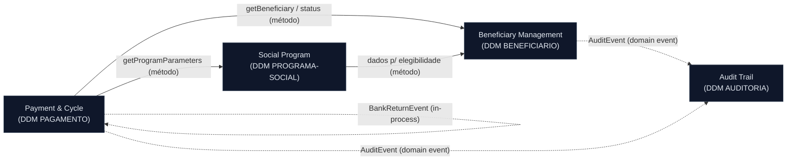

<!-- markdownlint-disable MD013 MD025 MD026 MD028 MD029 MD034 MD040 MD051 MD060 -->

# Mapa de Bounded Contexts — SIFAP 2.0

> Gerado por `/carve-bounded-contexts` a partir de
> [`../01-arqueologia/discovery-report.md`](../01-arqueologia/discovery-report.md)
> (5 hipóteses de recorte), cruzando
> [`../01-arqueologia/dependency-map.md`](../01-arqueologia/dependency-map.md) (acoplamento)
> e [`../01-arqueologia/business-rules-catalog.md`](../01-arqueologia/business-rules-catalog.md) (coesão).
>
> **Arquitetura-alvo:** Modular Monolith (Spring Boot 3.3). Comunicação **in-process**
> via interfaces de módulo e domain events — **não** HTTP entre serviços.
>
> ⚠️ **Status: PROPOSTA.** As recomendações abaixo (ACEITA/REJEITADA) são do agente.
> O Passo 3 do prompt exige **confirmação da equipe** — preencha a coluna "Decisão da
> Equipe" e a seção Aprovação antes de tratar como decidido.

## Critérios de Avaliação

| Critério | Como foi medido |
|----------|-----------------|
| **Coesão** | As regras (BR-*) do grupo pertencem à mesma capacidade de negócio? (business-rules-catalog) |
| **Acoplamento** | Quantas arestas de dados cruzam a fronteira proposta? (dependency-map; lembrando: 0 CALLNAT, só acoplamento por DDM) |
| **Frequência de mudança** | Programas que historicamente mudaram juntos (headers `ALTERADO`) e tocam o mesmo DDM |

> **Nota estrutural:** o legado não tem `CALLNAT`/`INCLUDE`. Todo acoplamento é por
> **DDM compartilhado**. Logo, a fronteira natural é o **ownership de DDM**, e o ponto
> crítico é o `PAGAMENTO`, tocado por 8 programas.

## Avaliação de Hipóteses

### Hipótese 1 — Cadastro de Beneficiário · Recomendação: **ACEITA**

Programas: `CADBENEF`, `CADDEPEND`, `VALBENEF`, `VALDOCS`, `CONSBENF`. DDM: `BENEFICIARIO`.

| Critério | Avaliação | Evidência |
|----------|-----------|-----------|
| Coesão | **Alta** | BR-002 (CPF mód.11), BR-016 (status idoso), BR-017 (dependentes), BR-018 (data), BR-012 (máscara CPF) — todas sobre o agregado Beneficiário |
| Acoplamento | **Baixo** | Todos escrevem/leem `BENEFICIARIO`; só `CONSBENF` lê `PAGAMENTO` (read-only, cruza p/ ctx Pagamento) |
| Freq. mudança | **Média** | Validações evoluíram juntas (2005/2010/2011) |

**Recomendação:** aceitar. É o agregado central; validações e consulta giram em torno dele. A leitura de histórico por `CONSBENF` vira consulta read-only ao contexto Pagamento.

### Hipótese 2 — Pagamento & Ciclo · Recomendação: **ACEITA (com ressalva)**

Programas: `BATCHPGT`, `CALCBENF`, `CALCDSCT`, `CALCCORR`, `RELPGT`. DDM: `PAGAMENTO`.

| Critério | Avaliação | Evidência |
|----------|-----------|-----------|
| Coesão | **Alta** | BR-001, BR-003 a BR-006, BR-008, BR-020 — núcleo financeiro (geração, cálculo, desconto, correção) |
| Acoplamento | **Alto** | `PAGAMENTO` é tocado por 8 programas de 3 contextos; lê `BENEFICIARIO` e `PROGRAMA-SOCIAL` |
| Freq. mudança | **Alta** | Cálculos alterados juntos (2009/2013/2015); BATCHPGT duplica CALCBENF (MYS-007) |

**Recomendação:** aceitar como o contexto central, **mas** resolver a duplicação BATCHPGT↔CALCBENF (MYS-007) e os 3 cálculos de desconto (MYS-006) — o motor de cálculo deve ser único dentro deste contexto. `RELPGT` é leitor: pode migrar para o contexto de Relatórios (ver H5).

### Hipótese 3 — Programa Social · Recomendação: **ACEITA**

Programas: `CADPROG`, `VALELEG`. DDM: `PROGRAMA-SOCIAL`.

| Critério | Avaliação | Evidência |
|----------|-----------|-----------|
| Coesão | **Alta** | BR-007 (FATOR-K), BR-013 (elegibilidade por tipo), BR-014 (região 99) — parâmetros e regras do programa |
| Acoplamento | **Baixo** | `CADPROG` é dono de `PROGRAMA-SOCIAL`; `VALELEG` lê `BENEFICIARIO` (cross read-only) |
| Freq. mudança | **Média** | Códigos de elegibilidade alterados (2003/2012/2013) |

**Recomendação:** aceitar. É a fronteira que possui as regras de elegibilidade e os parâmetros de cálculo que o contexto Pagamento **consome** (não duplica).

### Hipótese 4 — Conciliação & Auditoria · Recomendação: **ACEITA (ajustada)**

Programas: `BATCHCON`, `RELAUDIT`. DDM: `AUDITORIA` (+ escreve em `PAGAMENTO`).

| Critério | Avaliação | Evidência |
|----------|-----------|-----------|
| Coesão | **Média-Alta** | BR-009 (conciliação), BR-011 (auditoria oculta exclusões); integração CNAB + trilha |
| Acoplamento | **Médio** | Dono de `AUDITORIA`; `BATCHCON` **atualiza** `PAGAMENTO` (status pós-conciliação) → cruza p/ ctx Pagamento |
| Freq. mudança | **Média** | Auditoria adicionada 2014 nos dois |

**Ajuste recomendado:** separar duas preocupações que estão juntas:
- **Auditoria** (trilha, `AUDITORIA`) é um subdomínio transversal legítimo (motivador regulatório — MYS-004).
- **Conciliação bancária** (CNAB, atualização de status de pagamento) está mais próxima do ciclo de Pagamento.

Decisão proposta: **Auditoria** vira contexto próprio; a escrita de status por `BATCHCON` é modelada como o contexto Pagamento **reagindo** a um evento de retorno bancário (não a Conciliação escrevendo direto em `PAGAMENTO`).

### Hipótese 5 — Relatórios Gerenciais · Recomendação: **REJEITADA como contexto de domínio**

Programas: `BATCHREL` (+ `RELPGT`, `RELAUDIT` como leitores).

| Critério | Avaliação | Evidência |
|----------|-----------|-----------|
| Coesão | **Baixa** | "Relatório" é preocupação transversal, não capacidade de negócio; só consolida dados de outros |
| Acoplamento | **Muito alto** | Lê `PAGAMENTO`, `BENEFICIARIO`, `AUDITORIA` — atravessa todos os contextos |
| Freq. mudança | **Baixa** | Muda quando o formato de saída muda, não a regra |

**Recomendação:** **rejeitar** como bounded context. Tratar relatórios como **read models / consultas** que cada contexto expõe, ou uma camada de leitura (BI) fora do modelo de domínio. BR-019 (round vs truncate) é um detalhe de apresentação, não regra de domínio.

## Bounded Contexts Finais (proposta — 4 contextos)

### 1. Beneficiary Management (Gestão de Beneficiários)

- **Responsabilidade:** Possui o ciclo de vida do beneficiário e seus dependentes: cadastro, alteração, validação de dados (CPF módulo 11, data, nome, UF, documentos) e consulta. É a fonte da verdade dos dados pessoais e do status cadastral (`A/S/C/I/D`).
- **Dados próprios:** DDM `BENEFICIARIO` (→ tabelas `beneficiary`, `dependent`).
- **Interface pública:**
  - `findBeneficiaryByCpf(cpf): BeneficiarySummary`
  - `getBeneficiaryStatus(cpf): Status`
  - `validateBeneficiary(BeneficiaryInput): ValidationResult`
- **Por que é seu próprio contexto:** alta coesão (todas as BRs de cadastro/validação) e baixo acoplamento de escrita (único dono de `BENEFICIARIO`).

### 2. Payment & Cycle (Pagamento e Ciclo)

- **Responsabilidade:** Possui o ciclo de pagamento mensal: geração do ciclo para beneficiários ativos, cálculo do benefício (motor único), descontos, 13º/abono, correção retroativa e a máquina de estados do pagamento. Reage a retornos bancários para atualizar o status do pagamento.
- **Dados próprios:** DDM `PAGAMENTO` (→ tabela `payment`).
- **Interface pública:**
  - `generateMonthlyCycle(competence): CycleResult`
  - `calculateBenefit(cpf, competence): BenefitAmount`
  - `applyBankReturn(BankReturnEvent)` *(consumidor de evento)*
- **Por que é seu próprio contexto:** núcleo financeiro de altíssima coesão; concentra as regras CRÍTICAS (BR-001, 003–006, 008). **Ressalva:** eliminar a duplicação de cálculo (MYS-006, MYS-007) aqui dentro.

### 3. Social Program (Programa Social)

- **Responsabilidade:** Possui os programas sociais — parâmetros (valor-base, FATOR-K, faixas), vigência e as regras de elegibilidade por tipo (`A/P/T`) e código de elegibilidade. Provê os parâmetros que Payment consome.
- **Dados próprios:** DDM `PROGRAMA-SOCIAL` (→ tabela `social_program`).
- **Interface pública:**
  - `getProgramParameters(codProgram): ProgramParameters`
  - `checkEligibility(cpf, codProgram): EligibilityResult`
- **Por que é seu próprio contexto:** possui regras estáveis e distintas (elegibilidade, parâmetros) que outros contextos **consultam**, evitando duplicar a lógica de programa.

### 4. Audit Trail (Trilha de Auditoria)

- **Responsabilidade:** Registra e consulta eventos de auditoria (quem alterou o quê, quando) de todos os contextos, incluindo conciliação bancária. Subdomínio transversal com motivador regulatório.
- **Dados próprios:** DDM `AUDITORIA` (→ tabela `audit_event`).
- **Interface pública:**
  - `recordAuditEvent(AuditEvent)` *(consumidor de eventos)*
  - `queryAuditTrail(filter): List<AuditEvent>`
- **Por que é seu próprio contexto:** preocupação regulatória independente; resolve MYS-004 (hoje o legado oculta exclusões `'EX'` — na versão moderna a trilha deve ser completa).

> A **Conciliação bancária** (CNAB) não é um contexto: é um *adapter de entrada* do contexto Payment, que emite `BankReturnEvent` (consumido por Payment) e `AuditEvent` (consumido por Audit). **Relatórios** são read models, não contexto.

## Comunicação Inter-Context

| De | Para | Direção | Mecanismo | Dados trocados |
|----|------|---------|-----------|----------------|
| Payment & Cycle | Beneficiary Management | Payment → Beneficiary | Chamada de método (interface) | `cpf` → `BeneficiarySummary` + `Status` (somente leitura) |
| Payment & Cycle | Social Program | Payment → Social Program | Chamada de método (interface) | `codProgram` → `ProgramParameters` |
| Social Program | Beneficiary Management | SocialProgram → Beneficiary | Chamada de método (interface) | `cpf` → dados p/ elegibilidade (idade, renda, docs) |
| Beneficiary Management | Audit Trail | Beneficiary → Audit | Domain event | `AuditEvent` (inclusão/alteração) |
| Payment & Cycle | Audit Trail | Payment → Audit | Domain event | `AuditEvent` (conciliação/divergência) |
| Conciliação (adapter de Payment) | Payment & Cycle | adapter → Payment | Domain event | `BankReturnEvent` (num-pagto, CPF, valor, cód. retorno) |

> Reforço (Modular Monolith): leituras de dados de referência são **chamadas de método in-process** (interface do módulo, trocando IDs/DTOs leves). Eventos de auditoria e retorno bancário são **domain events** in-process. Nenhuma comunicação via HTTP entre módulos.

## Diagrama Mermaid do Mapa de Contexto

## Decisão da Equipe (preencher)

| Hipótese | Recomendação do agente | Decisão da Equipe | Raciocínio |
|----------|------------------------|-------------------|------------|
| H1 Cadastro de Beneficiário | ACEITA | <!-- preencher --> | |
| H2 Pagamento & Ciclo | ACEITA (resolver duplicação) | <!-- preencher --> | |
| H3 Programa Social | ACEITA | <!-- preencher --> | |
| H4 Conciliação & Auditoria | ACEITA (ajustada: Auditoria própria; Conciliação = adapter de Payment) | <!-- preencher --> | |
| H5 Relatórios Gerenciais | REJEITADA (vira read model) | <!-- preencher --> | |

## Artefatos-Fonte

- [`../01-arqueologia/discovery-report.md`](../01-arqueologia/discovery-report.md) — hipóteses de recorte
- [`../01-arqueologia/dependency-map.md`](../01-arqueologia/dependency-map.md) — acoplamento por DDM
- [`../01-arqueologia/business-rules-catalog.md`](../01-arqueologia/business-rules-catalog.md) — coesão (BR-*)
- [`../01-arqueologia/mysteries-found.md`](../01-arqueologia/mysteries-found.md) — riscos (MYS-004, MYS-006, MYS-007)

## Aprovação

- Revisado por: <!-- preencher -->
- Data: <!-- preencher -->
- Confiança: <!-- Alta / Média / Baixa -->
