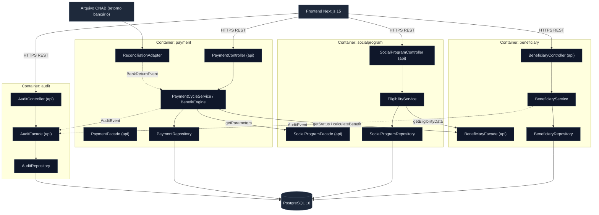

<!-- markdownlint-disable MD013 MD025 MD026 MD028 MD029 MD034 MD040 MD051 MD060 -->

# Design do Modular Monolith — SIFAP 2.0

> Gerado por `/design-modular-monolith` a partir de
> [`bounded-contexts.md`](bounded-contexts.md) (4 contextos),
> [`SPECIFICATION.md`](SPECIFICATION.md) (REQ-001..REQ-020) e os ADRs em
> [`ADRs/`](ADRs/).
>
> **Package base:** `com.datacorp.sifap` · **Comunicação:** mista (interfaces
> in-process + domain events — ADR-0002) · **Implantável:** único monolito
> (Spring Boot 3.3 — ADR-0001).
>
> ⚠️ **Status: PROPOSTA.** Blueprint para o Estágio 3; assinaturas, não implementação.

## Estrutura de Packages

A estrutura mapeia 1:1 para os bounded contexts. Somente `api/` e as interfaces
exportadas (em `api/` ou na raiz do package do contexto) são públicas; `domain/`,
`service/` e `repository/` são internos ao módulo.

```text
com.datacorp.sifap
├── beneficiary/                 # Bounded Context: Beneficiary Management
│   ├── api/                     # REST controllers + interface pública do módulo
│   ├── domain/                  # Beneficiary, Dependent, Cpf (VO), Status (internal)
│   ├── service/                 # Regras de cadastro/validação (internal)
│   └── repository/              # Acesso a beneficiary / dependent (internal)
├── socialprogram/               # Bounded Context: Social Program
│   ├── api/
│   ├── domain/                  # SocialProgram, EligibilityRule (internal)
│   ├── service/
│   └── repository/
├── payment/                     # Bounded Context: Payment & Cycle
│   ├── api/
│   ├── domain/                  # Payment, BenefitAmount, Discount, PaymentStatus
│   ├── service/                 # Motor único de cálculo/desconto/ciclo
│   ├── reconciliation/          # Adapter de entrada CNAB → BankReturnEvent
│   └── repository/
├── audit/                       # Bounded Context: Audit Trail
│   ├── api/
│   ├── domain/                  # AuditEvent (internal)
│   ├── service/
│   └── repository/
└── shared/                      # Transversal: tipos base, exceptions, eventos de domínio
    ├── events/                  # AuditEvent, BankReturnEvent (records imutáveis)
    └── error/                   # Exceptions e tipos de erro comuns
```

## Interfaces de Módulo

Cada contexto expõe **uma** interface pública. DTOs de fronteira são Java `record`.
Retornos anuláveis usam `Optional`.

### `beneficiary` — `BeneficiaryFacade`

```java
public interface BeneficiaryFacade {
    Optional<BeneficiarySummary> findByCpf(Cpf cpf);            // REQ-006 (mascarado)
    BeneficiaryStatus getStatus(Cpf cpf);                       // REQ-009 (consumido por Payment)
    ValidationResult validate(BeneficiaryInput input);          // REQ-001..REQ-004
    EligibilityData getEligibilityData(Cpf cpf);                // REQ-008 (consumido por Social Program)
}

public record BeneficiarySummary(Cpf cpf, String maskedCpf, String name, BeneficiaryStatus status) {}
public record EligibilityData(int ageYears, BigDecimal familyIncome, boolean documentsValid) {}
public enum BeneficiaryStatus { A, S, C, I, D }
```

### `socialprogram` — `SocialProgramFacade`

```java
public interface SocialProgramFacade {
    Optional<ProgramParameters> getParameters(String programCode);    // REQ-007 (consumido por Payment)
    EligibilityResult checkEligibility(Cpf cpf, String programCode);  // REQ-008
}

public record ProgramParameters(String code, char type, BigDecimal baseValue, BigDecimal adjustmentFactor) {}
public record EligibilityResult(boolean eligible, String reason) {}
```

### `payment` — `PaymentFacade`

```java
public interface PaymentFacade {
    CycleResult generateMonthlyCycle(YearMonth competence);     // REQ-009, REQ-010, REQ-013..REQ-015
    BenefitAmount calculateBenefit(Cpf cpf, YearMonth competence); // REQ-011..REQ-014 (motor único)
    List<PaymentView> findPayments(Cpf cpf, YearMonth competence);
}

public record CycleResult(YearMonth competence, int generated, int skipped, int errors) {}
public record BenefitAmount(BigDecimal gross, BigDecimal discount, BigDecimal net) {}

// Consumidor de domain event (não exposto como REST)
public interface BankReturnHandler {
    void onBankReturn(BankReturnEvent event);                   // REQ-016, REQ-017
}
```

### `audit` — `AuditFacade`

```java
public interface AuditFacade {
    void record(AuditEvent event);                              // REQ-018, REQ-020 (consumidor de eventos)
    List<AuditEvent> query(AuditFilter filter);                 // REQ-019 (trilha completa, inclui 'EX')
}

public record AuditFilter(LocalDate from, LocalDate to, String action, Cpf cpf) {}
```

## Comunicação Cross-Context

Estilo **misto** (ADR-0002). Toda chamada cross-context passa por uma interface ou por
um domain event — nunca por acesso direto a dados/entidades de outro módulo.

| De | Para | Mecanismo | Operação / Evento | Dados trocados |
|----|------|-----------|-------------------|----------------|
| `payment` | `beneficiary` | Interface in-process | `getStatus(cpf)` | `Cpf` → `BeneficiaryStatus` |
| `payment` | `socialprogram` | Interface in-process | `getParameters(code)` | `String` → `ProgramParameters` |
| `socialprogram` | `beneficiary` | Interface in-process | `getEligibilityData(cpf)` | `Cpf` → `EligibilityData` |
| `beneficiary` | `audit` | Domain event | `AuditEvent` (inclusão/alteração) | record imutável |
| `payment` | `audit` | Domain event | `AuditEvent` (conciliação/divergência) | record imutável |
| `payment/reconciliation` | `payment` | Domain event | `BankReturnEvent` | num-pagto, CPF, valor, cód. retorno |

> Eventos (`AuditEvent`, `BankReturnEvent`) vivem em `shared/events`. O consumidor deve
> ser idempotente (importante para REQ-010 e reprocessamento de CNAB).

## Diagrama C4 Component (Mermaid)



## Resumo de Endpoints

Convenção: `/api/v1/{resource}`. Esqueleto — detalhes de schema no Estágio 3.

### Beneficiary Management

| Método | Path | Resumo | Request | Response | REQ |
|--------|------|--------|---------|----------|-----|
| POST | `/api/v1/beneficiaries` | Cadastra beneficiário | `BeneficiaryInput` | `BeneficiarySummary` | REQ-001..REQ-004 |
| PUT | `/api/v1/beneficiaries/{cpf}` | Altera beneficiário | `BeneficiaryInput` | `BeneficiarySummary` | REQ-004 |
| GET | `/api/v1/beneficiaries/{cpf}` | Consulta beneficiário (CPF mascarado) | — | `BeneficiarySummary` | REQ-006 |
| POST | `/api/v1/beneficiaries/{cpf}/dependents` | Inclui dependente | `DependentInput` | `BeneficiarySummary` | REQ-005 |

### Social Program

| Método | Path | Resumo | Request | Response | REQ |
|--------|------|--------|---------|----------|-----|
| POST | `/api/v1/social-programs` | Cadastra programa social | `SocialProgramInput` | `ProgramParameters` | REQ-007 |
| GET | `/api/v1/social-programs/{code}` | Consulta parâmetros do programa | — | `ProgramParameters` | REQ-007 |
| GET | `/api/v1/social-programs/{code}/eligibility` | Avalia elegibilidade (query `cpf`) | — | `EligibilityResult` | REQ-008 |

### Payment & Cycle

| Método | Path | Resumo | Request | Response | REQ |
|--------|------|--------|---------|----------|-----|
| POST | `/api/v1/payment-cycles` | Dispara ciclo mensal (query `competence`) | — | `CycleResult` | REQ-009, REQ-010, REQ-013..REQ-015 |
| GET | `/api/v1/payments` | Consulta pagamentos (query `cpf`, `competence`) | — | `List<PaymentView>` | REQ-011, REQ-012 |
| POST | `/api/v1/reconciliations` | Submete retorno bancário (CNAB) | `multipart CNAB` | `ReconciliationResult` | REQ-016, REQ-017 |

### Audit Trail

| Método | Path | Resumo | Request | Response | REQ |
|--------|------|--------|---------|----------|-----|
| GET | `/api/v1/audit-events` | Consulta trilha completa (filtros via query) | — | `List<AuditEvent>` | REQ-018, REQ-019 |

## ADRs Relacionados

| ADR | Decisão | Parte do design afetada |
|-----|---------|-------------------------|
| [ADR-0001](ADRs/ADR-0001-modular-monolith.md) | Modular Monolith, não microservices | Estrutura de packages (1:1 com contextos); deploy único |
| [ADR-0002](ADRs/ADR-0002-inter-context-communication.md) | Comunicação mista (interfaces + domain events) | Interfaces de módulo e tabela de comunicação cross-context |

## Rastreabilidade

- Requisitos: [`SPECIFICATION.md`](SPECIFICATION.md) (REQ-001..REQ-020)
- Contextos: [`bounded-contexts.md`](bounded-contexts.md)
- OpenAPI: [`openapi.yaml`](openapi.yaml)

## Aprovação

- Revisado por: Luis Antonio Salles
- Data: 11/06/2026
- Confiança: Alta
